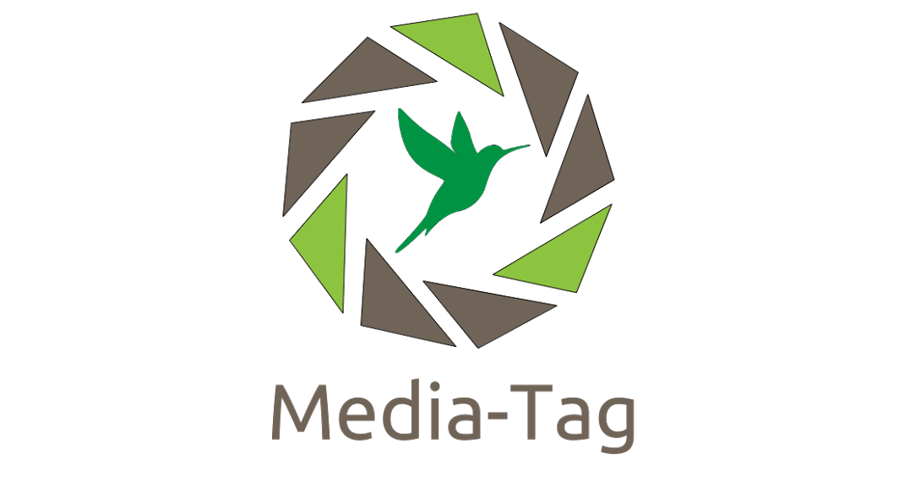

[ ](https://ucf-project.github.io/media-tag/ 'Media-Tag Project')

# Presentation

Media-Tag is an open source project related in Ubiquitous Content Framework developped by alter way's R&D team.

Based on common web technologies like HTML5 and JavaScript, it goal is provide an unified interface about rich content presentation.

## Modular

Media-Tag is able to render medias like, images, audios, videos, dash and pdf.
Each of theses features take form from a set of plugin registered to Media-Tag stores.
You can enrich the current version of Media-Tag with new features.
Media-Tag provides you various maner to add your own awesome plugins.


## Complex

Media-Tag provides several plugin types able have complex behaviours.
For example, Media-Tag contains features like crypto filter able to decrypt a Media-Tag content before it rendering.


## Efficient

Media-Tag can process automatically your new tags in dynamical execution context.
For example, you can use Media-Tag to allows chat users to display images, musics, videos ... directly in the chat.
Each static tag is processed only one time.
If some attributes change then the Media-Tag will be reprocessed automatically too.

If some developped plugins are incompatibles or their rules entre in conflict Media-Tag's engines are able to detect that kind of errors.


# Installation

We recommend the usage of [yarn](https://yarnpkg.com/) as package
manager but the library remains compatible with
[npm](https://www.npmjs.com/).

```
$ git clone git@github.com:UCF-project/media-tag.git  # Clone  the project
$ cd media-tag		# Enter the project folder
$ yarn install 		# Install dependencies
```

# Builds

| Script | Description |
|--------|-------------|
| build:dev | Produce an ES6 build into UMD style |
| build:pro | Produce an ES5 build into UMD style |
| build:amd | Convert sources to AMD |
| build:site | Produce an ES6 build of the site, no minified |
| build:docs | Produce some documentation |

*example*

```
yarn build:dev
yarn build:pro
yarn build:amd
yarn build:docs
...
```

# Start

```
$ yarn start

#website is accessible @ http://localhost:3000/
```

Builds and launches the site with the lastest media-tag modifications in development mode.


# Usage

```html
<!DOCTYPE html>
<html>
<head>
	<title>My Page with Media Tag</title>
	<script type="text/javascript" src="media-tag.js"></script>
</head>
<body>
	<media-tag
		src="image-without-extension"
		data-type="image"
		data-attr-width="300px"
		data-attr-height="200px"></media-tag>
</body>
</html>
```

# Development

To start a web server and automatic builds when changing files you can
use:

```sh
$ yarn start
```

To run tests (linter, unit tests and test coverage) you can use:

```sh
$ yarn test
```

To build the documentation at `./dist/docs/` you can use:

```sh
$ yarn run build:docs
```

# Find more information

The site is included to the project, so your can run `yarn start` after your installation to find needed information.

Or you can follow this link : [Media-Tag's presentation website](https://ucf-project.github.io/media-tag/ 'Media-Tag Project')
